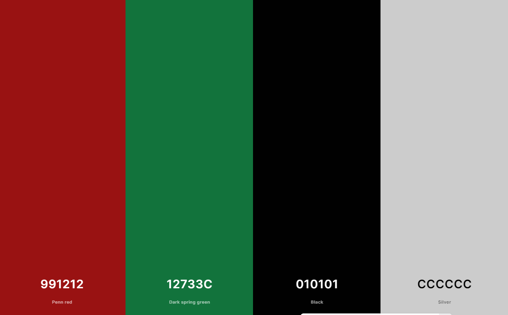
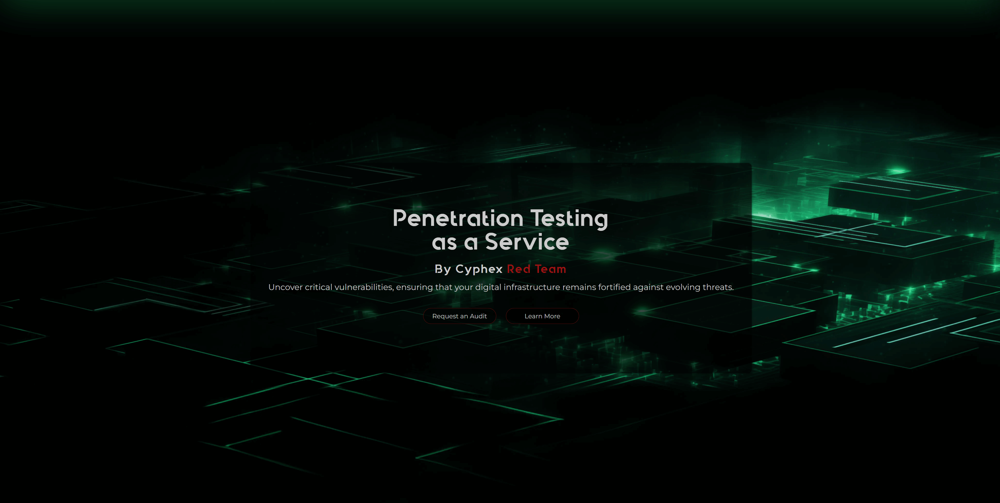
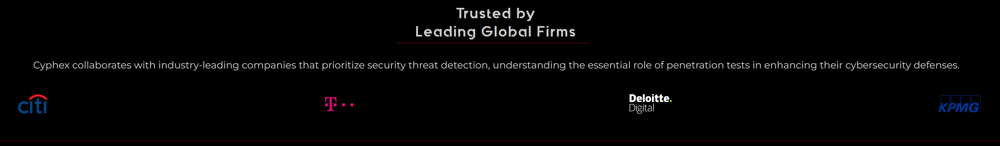
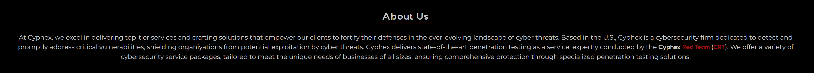
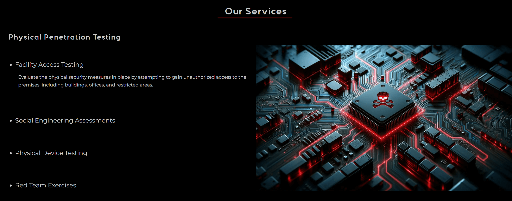
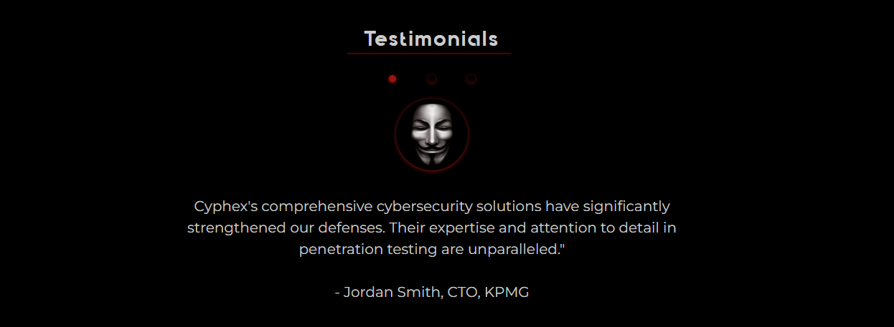
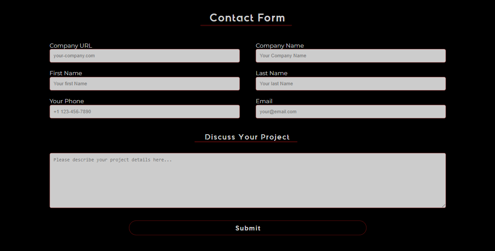
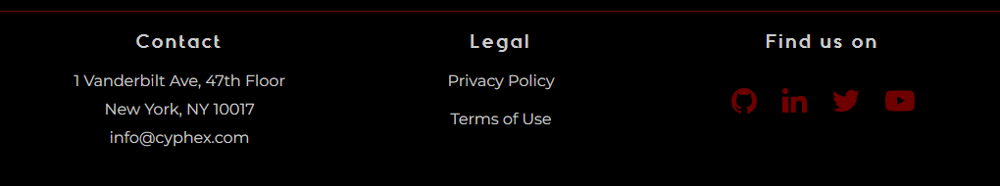

# 

 
 

 
 

Cyphex is a cutting-edge cybersecurity website offering comprehensive penetration testing services. Our platform is designed to help businesses identify and address potential vulnerabilities in their digital infrastructure, ensuring robust protection against evolving cybersecurity threats.

## Live Demo
[Click here for a live demo of Cyphex](https://parabytes.github.io/Portfolio_Project-1.2_html-css/).
 

## Table of Contents

- [Introduction](#introduction)
- [User Story](#user-story)
- [Wireframing Process](#wireframing-process)
- [Design Choices](#design-choices)
- [Technologies Used](#technologies-used)
- [Features](#features)
- [Testing](#testing)
- [Deployment](#deployment)
- [Credits](#credits)

## Introduction

Landing Page of a Cyber Security and Penetration Testing company called Cyphex.
Cyphex is a fictional penetration testing company, and the Cyphex Penetration Testing Landing Page serves as the company's online hub. This landing page is designed to provide a clear and engaging introduction to Cyphex's services and expertise in the field of cybersecurity.

## User Story:

As a business professional visiting the Cyphex B2B website, I aim to efficiently access essential information about the company's cybersecurity services, understand their expertise in penetration testing, and have a straightforward way to initiate contact for potential collaboration or security audit. Additionally, I expect the website to be responsive and tailored to the needs of businesses.
As a first-time visitor, I want to quickly grasp the purpose and content of the site

### **Homepage Header**:
- Upon landing on the homepage, I expect a professional and well-structured header with a company logo.

### **Navigation Menu**:
- The website should cater to the specific needs of businesses, allowing me to easily explore different sections of the website using the menu located in the header.

 ### **"Hero" Section**:
- The hero section on the homepage should prominently display the headings telling me what it's about at first glance. and how Cyphex's services can enhance my business's cybersecurity.
- In the hero section, I should encounter two distinct options either if I'd like to learn more about the company and their services or if I want to get in touch.
- Clicking "Request an Audit" should lead me smoothly to the contact form section.
- Clicking "Learn More" should lead me to a section with detailed information about the company and its services.

### **"Trusted by Leading Global Firms" Section**:
- The section titled "Trusted by Leading Global Firms" should showcase logos of well-known businesses that have partnered with Cyphex to build trust.

### **"About Us" Section**:
- The "About Us" section should offer a detailed overview of Cyphex's commitment to serving businesses.
- It should include information about the company's mission, location, and an elaborate description of their services.

### **"Our Services" Section**:
- Within the "Our Services" section, services should be categorized by topics.
- The services should be clearly visible at a glance and provide additional information if necessary.

### **"Testimonials" Section**:
- The "Testimonials" section should prominently showcase testimonials from satisfied business clients.
- Each testimonial should include the client's name and position, adding credibility and trustworthiness to Cyphex's services.

### **"Contact Form" Section**:
- The "Contact Form" section must house a user-friendly form tailored to businesses.
- Fields should be clearly labeled and accessible.
- The form should also include a textarea for outlining project details and a "Submit" button for efficient communication.

### **Footer**:
- In the footer section, I should find essential contact information of Cyphex, including their physical address and email address.
- Links to the Privacy Policy and Terms of Use should be present, offering transparency and trust for business clients.
- The footer's social media icons should be clickable and open relevant pages in new tabs.

### **Responsiveness**:
- The website should be meticulously designed and developed to be responsive, ensuring a seamless user experience across various business devices such as desktops, laptops, tablets, and mobile phones.

### **Performance**:
- To ensure optimal efficiency for business users, the website should prioritize fast loading times.
- All links, forms, and interactive elements should function flawlessly and without any issues.

## Wireframing Process

Starting with the wireframing phase, I began sketching out the project's blueprint. Here's a quick rundown of this stage:

- **Initial Sketches**: Both mobile and desktop layouts were first sketched by hand to conceptualize the basic structure.
- **Digital Wireframe for Desktop**: A detailed digital wireframe was created exclusively for the desktop version.
- **Tool Used**: The wireframe was designed using "Justinmind," a free wireframing tool.
- **Approach**: Notably, this was one of the few instances where a non-mobile-first approach was employed in the design process.
- **Link to Desktop Wireframe**: View the desktop version wireframe [here](presentation/wireframe.webp).

**Iterative Changes During Development:**

As the project evolved from wireframes to final implementation, several adjustments were made:

- **Hero Section Layout**: Initially planned for a left-aligned text layout in the hero section for the desktop version, the content was later centered for a more balanced aesthetic.
- **Slider Functionality**: The slider, an interactive element in the project, was not part of the original wireframe. It was integrated during the development phase to enhance user engagement and experience.

## Design Choices
### 1. **Color Scheme**
The color palette was created with [Coolors](https://coolors.co/991212-12733c-010101-cccccc-ffffff)

 
 

- Primary Background: Black
- Text Color: Light Grey (Almost White)
- Accent Color: Bright Green
- Highlight Color: Red (for underlines and box borders)

In the style.css file, a :root pseudo-class was established, where all colors and their variations were defined as global CSS variables. This approach ensures consistency throughout the design and simplifies the process of experimenting with different color palettes by just altering the variable properties. 

The implementation of this feature was guided by a tutorial, which can be found [here](https://www.w3schools.com/css/css3_variables.asp)

### 2. Typography:

**Quantify v2 (Heading and Logo Font)**
- Quantify v2 was used because of it's tech vibe, aligning perfectly with the website's theme, making it ideal for headings and the logo.
- Attention-Grabbing: Its bold and unique design ensures headings and the logo stand out, capturing users' attention effectively.

**Montserrat (Body Text Font)**
- Readability and Simplicity: Montserrat's clean and simple design enhances content readability, providing a user-friendly reading experience.
- Professionalism: While adhering to the cyberpunk theme, Montserrat maintains a professional appearance, suitable for conveying important information with trustworthiness.

### 3. Images:

- The hero image utilizes ta bright green color sparingly in images to create eye-catching focal point.
- The futuristic hacker-themed imagery of the "Our Services" section complements the cyberpunk style.

All three theme images were created with [Midjourney](https://www.midjourney.com/)

### 4. Layout and Structure:

- A professional and organized layout structure was choosen while still incorporating cyberpunk design elements, such as futuristic imagery, lines and shadow effects to add depth and dimension to elements on the page.

Layout and Structure:

Maintain a professional and organized layout structure while incorporating cyberpunk design elements, such as futuristic shapes, lines, and overlays.
Implement shadow effects to add depth and dimension to elements on the page.
Customizability:

Ensure that your CSS variables (e.g., --color-secondary, --color-primary, etc.) are well-documented in your CSS code, making it easy for you or others to customize the color scheme in the future.
Consistency:

Maintain a consistent design throughout the website to create a cohesive and visually appealing user experience.
Accessibility:

While embracing a dark cyberpunk theme, be mindful of accessibility standards and ensure that text remains legible against the dark background.
By incorporating these elements into your website design, you can achieve a hacker-like cyberpunk style while maintaining a professional and user-friendly structure. This style can help your website stand out and create a memorable user experience.

### 5. Accessibility:

- Text legibility against the dark background is a priority, ensuring that content remains readable.

### 6.  Design Critique & Considerations for Professionalism and Accessibility
It's important to acknowledge that while the chosen cyberpunk theme aligns perfectly with the project's creative and artistic direction, there are some potential considerations for a real-life professional B2B site:

- Professionalism: For a professional B2B website, the use of cyberpunk-themed images and vibrant red and green accents may appear somewhat unconventional and could be perceived as less serious. In a real company context, a more restrained color palette, featuring shades of blue, and a brighter theme might be preferred to convey a sense of seriousness and trustworthiness.

- Adaptable Structure and Fonts: It's worth noting that the chosen structure and fonts have the versatility to cater to both the artistic cyberpunk approach and a more conventional business aesthetic. This adaptability allows for a seamless transition between different themes, catering to a broader audience.

Additionally, it's essential to address accessibility concerns:

- Color Blindness Consideration: The website's use of red and green as accent and highlight colors may pose challenges for users with color blindness. Future enhancements should consider alternative color choices or provide options for users to adjust the color scheme for improved accessibility.

I want to implement a feature like a dark mode/bright mode that not only changes the color scheme but also the images of the hero section and our services section. (professional & hacker theme switch). the code of the website is organized in a way that it would be easily done. but therefore a bit java script has to be used to load the images. with css  it would be possible with a checkbox toggle approach like in the testimonial section but then all conent for both themes would be loaded initially when opening the page. this would have a negative effect on the performance of the page. also the current theme couldnt be saved when going to another url on the page.
the site is constructed in a way which makes it easy to change the theme. 

## **Aesthetic Elements**:
Utilization of Google Fonts, custom font faces, and a carefully chosen color palette.
General Design and Layout
Responsive Design: Adapts to various screen sizes from phones to large desktops.
Color Palette: A sophisticated color scheme with primary, secondary, and accent colors defined for consistency.
Font Styling: Uses Google fonts (Montserrat) and a custom font ('QuantifyBold') for distinct text presentation.
Global Style Reset: Ensures consistency across browsers by resetting default margins, padding, and box-sizing.

Detailed Development & Design Information:
If you're interested in diving deeper into the development and design process of this project, please refer to the [Development&Design guide](dev_doc.md).

## Technologies Used

### Languages
- HTML5
- CSS3

### Tools
- [Tinypng.com](https://www.tinypng.com/)  - to compress images for performance optimization.
- [Midjourney](https://www.midjourney.com/) - for image content generation.
- [Justinmind](https://www.justinmind.com/) - for crafting the Wireframe.
- [Adobe Photoshop](https://www.adobe.com/at/products/photoshop.html) - for Logo creation and image editing of generated content.
- [Google Fonts](https://fonts.google.com/) - for flow-text typography.
- [www.fontslots.com](https://www.fontslots.com/) - for Headings and Logo typography.

## Features

### Navigationbar
- **Logo**: Clickable company logo linking back to the homepage.
- **Responsive Menu**: Hamburger icon revealing a navigation menu for mobile devices with links to Home, About Us, Our Services, Testimonials, and Contact Us.
- **Fixed Position**: Stays at the top of the screen for easy navigation.

    

### Landing page image
- **Full-Height Background Image**: Creates a strong visual impact upon landing on the page.  
- **Catchy Headlines**: Emphasizes the service offerings with engaging typography.
- **Call-to-Action Buttons**: "Request an Audit" and "Learn More" buttons to guide user interaction.

### Our Clients Section
- **Trusted by Leading Firms**: Showcases client logos, demonstrating credibility and trust.
- **Responsive Grid Layout**: For displaying client logos in an organized manner.

### About Us Section
- **Detailed Overview**: Information on Cyphex's mission, U.S. location, and description of services.
- **Visual and Textual Emphasis**: Uses custom font styling for key phrases.

### Our Services Section
- **Services Section**: Detailed Service Breakdown: Categorized into Physical and Virtual Penetration Testing.
- **Detailed Descriptions**: Expandable content for in-depth insights into each service.

### Testimonials
- **Client Feedback**: Features testimonials from satisfied business clients, adding credibility.
- **Interactive Slider**: Allows users to navigate between different testimonials.

### Contact Form
- **User-Friendly Form**: Fields for essential contact details and project descriptions.
- **Submit Button**: For easy submission of inquiries.

### Footer
- **Contact Information**: Includes physical address and email.
- **Legal Links**: Directs to Privacy Policy and Terms of Use links that lead to seperate pages.
- **Social Media Icons**: Links to GitHub, LinkedIn, Twitter, and YouTube.

### Responsiveness and Styling
- **Responsive Design**: Ensures a seamless user experience across various devices.
- **Interactive Elements**: Hover effects, dropdowns, and sliders to enhance user engagement.

## Future Features

### Theme Switcher with JavaScript

The current website design embraces a dark cyberpunk theme, aligning perfectly with its artistic approach. However, recognizing the importance of adaptability and catering to diverse user preferences, there is a plan to introduce a "Theme Switcher" feature in the future.

- Enhanced User Experience: The Theme Switcher will give the users the ability to toggle between the existing dark cyberpunk theme and a brighter, more conventional (professional) theme. This flexibility ensures that the website can cater to both professional and artistic preferences, enhancing the overall user experience.
Since it is a portfolio page this feature makes sense (not as a real live use case).

- Comprehensive Theme Transformation: Going beyond a mere color scheme change, the Theme Switcher will also dynamically update the images in the hero section and the "Our Services" section to align seamlessly with the selected theme. This comprehensive transformation will immerse users in a consistent visual experience throughout the website.

- Efficient Implementation with JavaScript: While it is theoretically possible to achieve theme switching using CSS alone through a checkbox toggle approach (similar to the one in the "Testimonials" section), such an implementation has its drawbacks. With CSS-only approaches, all content for both themes would be loaded initially when opening the page, potentially impacting performance. Additionally, the chosen theme wouldn't persist as users navigate across different URLs of the website. To overcome these limitations and ensure a seamless user experience, JavaScript will be employed.

- Persistence Across Pages: JavaScript enables the Theme Switcher to maintain the user's chosen theme consistently as they navigate from one page to another within the website. This persistence ensures a cohesive and personalized browsing experience, aligning with modern web standards and user expectations.

By introducing the Theme Switcher with JavaScript, the project aims to offer users the freedom to tailor their browsing experience while maintaining the current cyberpunk theme. This approach strikes a balance between artistic creativity and user-friendly functionality, enhancing user engagement and satisfaction.

In summary, the Theme Switcher feature is a neat idea for a portfolio page, showcasing the project creator's adaptability and commitment to providing a user-centric experience.

## Testing

Detailed testing procedures and outcomes are documented [here](TESTING.md).

### Issues and Solutions
In the Search form, I initially used label for = " " to hint the value of the input field to the users but couldn't align it vertically within the box using Materialize classes and CSS. It was placed underneath the input field. After trying few things, I replaced it with placeholder = " " and it solved the issue.
When I tried to sort all the terms displayed in the Glossary Page in alphabetical order using sort() function, I noticed it was sorting first capitalized items and then again items beginning with lower case letters. I used upper() function in my insert_term functionality so all charachters on a string are converted to uppercase before being stored in the database.
During the tests, some of the buttons didn't render correctly on mobile devices on Safari and Mozilla. This was fixed by removing unnecessary type="submit" from the links styled as buttons where.

## Deployment

To deploy my project on GitHub, I followed these steps:

- I went to the Settings tab in my GitHub repository.
- From the source section drop-down menu, I chose the Master Branch as the source for GitHub Pages deployment.
- After selecting the master branch, the page refreshed automatically, confirming the successful deployment.

You can view the live site by clicking [here](https://parabytes.github.io/Portfolio_Project-1.2_html-css/).

## Credits and Acknowledgments

### Content
- The project structure and text content were inspired by [Cybri](https://cybri.com/).
- The README.md documentation structure was inspired by [Nazulka](https://github.com/Nazulka/WD-Buzzwords#future-features).

### Media

#### Icons
- Footer icons: Created by [Bypeople](https://www.svgrepo.com/collection/minimal-ui-icons/), licensed under Public Domain / CC0 1.0 Universal (CC0 1.0) Public Domain Dedication.
- Burger menu icon: Designed by Isaque Pereira Cordeiro, sourced from The Noun Project. This icon is licensed under Public Domain, Creative Commons Attribution License (CC BY 3.0), and Royalty-Free License. More details can be found on [The Noun Project's licensing page](https://thenounproject.com/pricing).

#### Fonts
- Quantify v2 font: Designed by [Senhikari](https://www.behance.net/Senhikari).

### Code
- Project inspiration: CI Love Running project by [Code-Institute-Solutions](https://github.com/Code-Institute-Solutions/love-running-v3/tree/main).
- Small parts of code from the CI Love Running project were used in this project (refer to comments in style.css & index.html).

### Tutorials & Documentation Resources
- Custom font "Quantify" implementation: [MDN Web Docs](https://developer.mozilla.org/en-US/docs/Web/CSS/@font-face?retiredLocale=de).
- Global CSS color variables: [W3Schools](https://www.w3schools.com/css/css3_variables.asp).
- Hero-text transform function: [MDN Web Docs](https://developer.mozilla.org/en-US/docs/Web/CSS/transform-function/translate).
- Testimonials section slider: Achieved using nth-child and checked [Stack Overflow](https://stackoverflow.com/questions/8649662/can-checked-and-nth-child-be-used-together).
- "Our Services" section reverse function: [Alisa Eeed's Blog](https://www.alisaeeed.com/webflow-code-to-the-rescue/create-cms-layout-with-alternating-image-grid-nth-child).
- Clients section grid layout: [CSS-Tricks](https://css-tricks.com/auto-sizing-columns-css-grid-auto-fill-vs-auto-fit/).

[Back to Top](#top)

